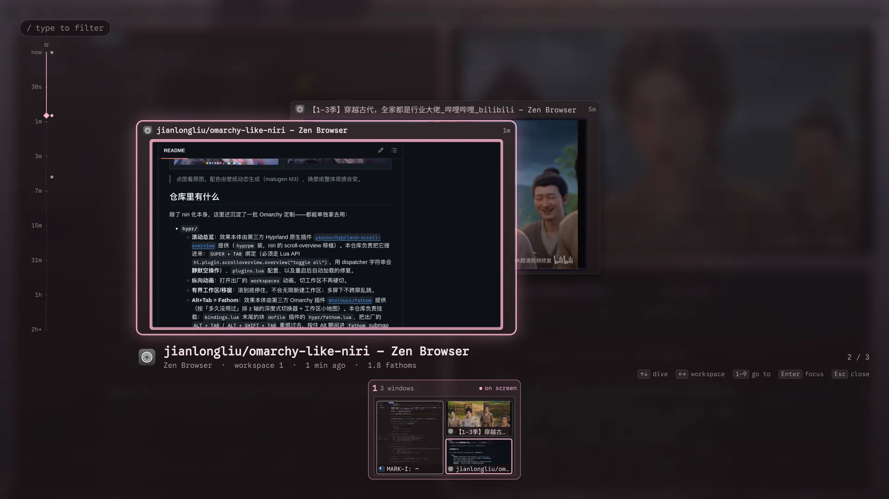

# omarchy-like-niri

在 **Hyprland** 上把 [Omarchy](https://github.com/basecamp/omarchy) 的工作区操作改成 **[niri](https://github.com/YaLTeR/niri) 风格**：滚动总览 + 纵向平滑切换。

> ⚠️ 与笔记本那台 [omarchy-on-niri](https://github.com/jianlongliu/omarchy-on-niri)（**真正的 niri 移植**）不同：本仓库跑在 **Hyprland** 上，只是把**操作习惯**做成 niri 的样子，不是 niri 移植。
>
> 实测环境：**Omarchy 4.0.4 / Hyprland 0.56.2**（详见各文档头部「最后核对」）。

## 效果

| 交互 | 装好后 | Omarchy 出厂 | 由谁提供 |
| --- | --- | --- | --- |
| `SUPER + TAB` | **滚动总览**：工作区卡片网格 + 背景模糊，滚轮带动画切换 | 此键原是「下一个工作区」，出厂**无总览功能** | 插件 [`yayuuu/hyprland-scroll-overview`](https://github.com/yayuuu/hyprland-scroll-overview)（`hyprpm` 装，niri 的 scroll-overview 移植）+ 本仓库的绑定与配置 |
| `SUPER + 滚轮`（平铺下） | 工作区**纵向滑动**切换；滚到空工作区就停住 | 硬切（`workspaces` 动画出厂关闭） | 本仓库（`bindings.lua` 的有界工作区函数） |
| `SUPER + CTRL + ↑/↓` | 把当前窗口移到上/下工作区，**碰到空工作区停住** | 无边界，会一直往下跑 | 本仓库（`bindings.lua` 的有界移窗函数） |
| `SUPER + PAGE_UP/DOWN` | 上/下一个工作区 | 同 | 本仓库（绑定） |
| `ALT + TAB` | **Fathom 深度式窗口切换器**：窗口按「多久没用过」排 z 轴，最近用的在最前、越久越退远（观感类似 Vista 的 Aero Flip 3D），按住 Alt 用 Tab / 滚轮 / 方向键下潜、松开聚焦，堆栈下方还有工作区小地图 | 出厂的循环切换（`cycle_next` / `bring_to_top`） | 插件 [`mtolhuys/fathom`](https://github.com/mtolhuys/fathom)（`omarchy plugin add` 装）+ 本仓库 `hypr/bindings.lua` 的挂载块 |

## 截图

|  |  |
| :---: | :---: |
| **滚动总览** `SUPER + TAB`<br>[](screenshots/scroll-overview.webp) | **纵向平铺 + 悬浮栏**<br>[](screenshots/tiling.webp) |
| **底栏与 Arc Dock**（图标随主题着色）<br>[](screenshots/bar-dock.webp) | **锁屏**：Split 设计 + 自定义显示名<br>[](screenshots/lock-screen.webp) |
| **Alt+Tab**：Fathom 深度切换器（按「多久没用过」排 z 轴，标题行里的 *fathoms* 就是深度单位）<br>[](screenshots/alt-tab.webp) |  |

> 点图看原图。配色由壁纸动态生成（matugen M3），换壁纸整体观感会变。

## 仓库里有什么

除了 niri 化本身，这里还沉淀了一批 Omarchy 定制——都能单独拿去用：

- **`hypr/`**
  - **滚动总览**：效果本体由第三方 Hyprland 原生插件 [`yayuuu/hyprland-scroll-overview`](https://github.com/yayuuu/hyprland-scroll-overview) 提供（`hyprpm` 装，niri 的 scroll-overview 移植）。本仓库负责把它接进来：`SUPER + TAB` 绑定（必须走 Lua API `hl.plugin.scrolloverview.overview("toggle all")`，用 dispatcher 字符串会**静默空操作**）、`plugins.lua` 配置、以及重启后自动加载的修复。
  - **纵向动画**：打开出厂的 `workspaces` 动画，切工作区不再硬切。
  - **有界工作区/移窗**：滚到底停住，不会无限新建工作区；多屏下不跨屏乱跳。
  - **Alt+Tab = Fathom**：效果本体由第三方 Omarchy 插件 [`mtolhuys/fathom`](https://github.com/mtolhuys/fathom) 提供（按「多久没用过」排 z 轴的深度式切换器 + 工作区小地图）。本仓库负责挂载：`bindings.lua` 末尾的块 `dofile` 插件的 `hypr/fathom.lua`，把出厂的 `ALT + TAB` / `ALT + SHIFT + TAB` 重绑过去，按住 Alt 期间进 `fathom` submap（`ALT+F4`、`ALT+SPACE` 等不受影响）；插件没装或被禁时整段空转，自动回落出厂行为。
- **`omarchy/`**
  - **自改插件**：`jianlongliu.*` 共 9 个，**6 个在跑**（5 个克隆自内建 + 1 个自建 `arch-logo`）。含工作区指示器 **GNOME 胶囊**、卡片式 OSD、Arch logo 菜单、键盘布局、更新提示等。
  - **LUKS 开机解密屏**：① 等待动画改成沿面板边界的竖线（上游圆弧在 4K 上只有一个小点）；② **屏上的时间/日期是活的**——`bootclock` mkinitcpio hook 在 plymouthd 之前把本次启动时间写进主题键文件的 `[script-env-vars]`，主题脚本用 `Image.Text` 画回原位（Plymouth **没有**时间 API，只有注入这条路人）。两者见 [`omarchy/patches/`](omarchy/patches/) 与 `docs/omarchy-plugins.md` §8.6。
  - **锁屏**：Split 设计副本，显示名可自定义（上游只认登录名）。
  - **磨砂玻璃 / 浮栏 / 边框**：layer_rule + 主题 alpha + matugen 动态色，多层视觉同源。
  - **登录界面壁纸跟随桌面**（SDDM）。
- **`docs/`**：上面每一项的完整做法、验证命令与回退路径。

## 依赖

- 目标机需是 **Omarchy**（配置依赖 `o.*` / `hl.*` 助手）。
- 滚动总览需要**联网装一次**第三方插件：`hyprpm add https://github.com/yayuuu/hyprland-scroll-overview.git`（插件编译失败时按文档用 git rev 锁定适配版本）。其余功能只用 Omarchy/Hyprland 自带能力。
- Alt+Tab 的 Fathom 也是第三方插件，装一次即可：`omarchy plugin add https://github.com/mtolhuys/fathom --enable`（没装时 Alt+Tab 自动回落出厂行为，不会报错）。

## 安装

按 [`docs/omarchy-nirification.md`](docs/omarchy-nirification.md) 文首的「执行顺序总览」逐条执行，每步都带**验证 + 回退**。

### 交给 AI agent 执行

教程已在仓库内，clone 即自包含。把下面这段丢给 AI agent：

```
按 docs/omarchy-nirification.md 的「执行顺序总览」逐步安装 niri 化配置。
要求：
1. 每步先读对应章节再动手，做完一步用文档里的「验证」确认过了再下一步。
2. 步骤 1-7 是核心（插件安装、插件配置、自加载、纵向动画、快捷键、有界工作区、有界移窗）；
   8 是多屏适配（接第二块屏时必做）；9 可选（nautilus 浮动）；10 总验证。
3. 每改一个 hypr 配置文件先备份，出问题按该步骤「回退」还原。
4. 全部完成后跑一遍「验证」章节，hyprctl configerrors 必须为空。
5. 目标机必须是 Omarchy（依赖 o.*/hl.* 助手），否则不适用。
```

> 桌面机没有触控板：文档第八节的触控板手势用不上，跳过即可（文档里已标注为可选）。

## 仓库结构

| 目录 | 对应本机位置 | 内容 |
| --- | --- | --- |
| [`hypr/`](hypr/) | `~/.config/hypr` | Hyprland 配置：滚动总览接入（绑定 + 自加载）、纵向动画、niri 化快捷键、有界工作区/移窗函数 |
| [`omarchy/`](omarchy/) | `~/.config/omarchy` | shell 配置 + 自改 `jianlongliu.*` 插件 + 锁屏设计 + 第三方插件补丁文档 |
| [`docs/`](docs/) | — | 三篇参考文档（见下） |
| [`screenshots/`](screenshots/) | — | README 截图（webp，1920×1080） |

> 克隆插件位于 `~/.config/omarchy/plugins/`，**不在系统包内，`omarchy update` 不会覆盖**。纳入 git 是为了**版本回退 + 备份/迁移**，并非防 update 覆盖（本就不需要）。

## 文档

| 文档 | 内容 |
| --- | --- |
| [`omarchy-nirification.md`](docs/omarchy-nirification.md) | **niri 化安装教程**：分步、每步带验证与回退 —— **从这里开始** |
| [`omarchy-visual-tweaks.md`](docs/omarchy-visual-tweaks.md) | bar 视觉定制：字号/图标对齐、磨砂玻璃与 layer rule、工作区胶囊、字体链、锁屏、SDDM 壁纸同步、matugen 动态配色 |
| [`omarchy-plugins.md`](docs/omarchy-plugins.md) | 插件清单与管理命令（按真实 `shell.json` 同步）+ 本地补丁记录（含开机解密屏的等待竖线与活时钟）+ 上游跟踪（clone 对 omarchy、第三方插件对作者） |

## 说明

- **⚠️ 这是 vibe coding 的产物，建议交给 AI agent 安装。**
  这套配置由单人 + AI agent 长期迭代而成，**已知粗糙**：无测试、无 CI，多数结论只在本机（Omarchy 4.0.4 / Hyprland 0.56.2）当场验过一次，版本一变就可能失效；历史上有过改错文件、写坏补丁、脱敏搞出乱码这类事故。文档写得细（每步带验证与回退）正是为了弥补这一点——**按文档走 + 每步验证**比凭经验手改可靠得多。出问题别硬猜，把对应文档章节和报错一起交给 agent 排查。
- 配置与文档由 AI agent 生成/整理，含 AI 协助调参、排障。
- 各插件版权归原作者：滚动总览属 [`yayuuu/hyprland-scroll-overview`](https://github.com/yayuuu/hyprland-scroll-overview)；自改 `jianlongliu.*` 克隆插件基于 Omarchy 内建插件；补丁均注明上游与基准版本。
- 改动历史见 [`hypr/CHANGELOG.md`](hypr/CHANGELOG.md) 与 [`omarchy/CHANGELOG.md`](omarchy/CHANGELOG.md)。
- [`omarchy/lock-avatar.png`](omarchy/lock-avatar.png)：锁屏头像样例（lock-explorer 探测的首选路径）。拷到 `~/.config/omarchy/lock-avatar.png` 即被读取；不想要就删，锁屏回落显示首字母。
